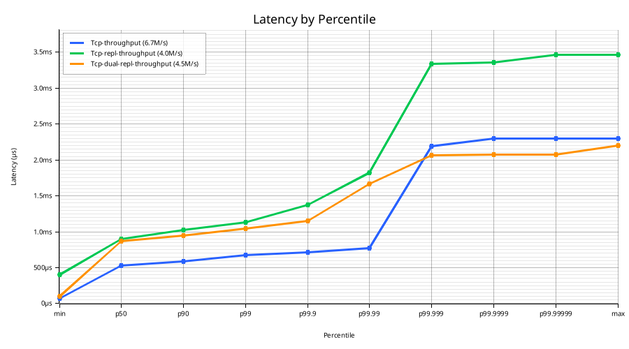
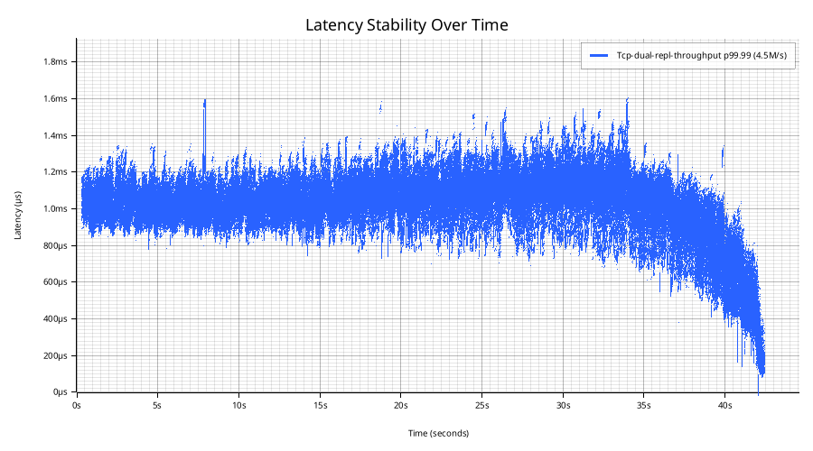

# Melin

Melin is a high-performance exchange core written in Rust on the [LMAX disruptor architecture](https://martinfowler.com/articles/lmax.html), built for venues that cannot compromise on correctness, durability, or performance.

Melin handles order matching, account balances, risk controls, circuit breakers, fee schedules, journaling, and replication — the critical path of an exchange, from order ingestion to durable execution.

## Why Melin

**Correct** — every order matches exactly where it should, every time.
- Strict price-time priority verified by property-based tests across thousands of random order sequences
- Cross-validated against independent matching engine implementations and real market data
- Deterministic replay guarantees identical state from the same journal
- Verified by property-based, fuzz, crash-injection, cross-engine differential, and multi-process failover tests — more than 700 scenarios in total

**Durable** — every order is persisted and replicated before acknowledgement.
- Crash recovery via journal replay with CRC32C integrity checks
- BLAKE3 hash chain for tamper evidence
- Dual-replication to survive and recover from major outage scenarios

**Efficient** — 1.09M orders/sec at sub-400 µs p99 with synchronous dual replication on regular datacenter hardware.
- Single-threaded matching engine on a lock-free disruptor pipeline
- Journal, matching, and replication run in parallel via io_uring
- 24 µs p99 single-order latency with quorum durability (dual replication)

**Design partners wanted.** We are looking for one or two design partners willing to run Melin in a non-critical capacity — internal crossing, a new instrument, a parallel-run alongside an existing engine — in exchange for direct engineering support and influence over the roadmap. Get in touch: [contact@melin-engine.com](mailto:contact@melin-engine.com).

## LAN Benchmarks

All numbers are **full round-trip**:

1. Client sends order
2. Server durably persists (local journal + replicas, per configured durability mode)
3. Matching engine executes
4. Response arrives at client

Measured over LAN using four AMD EPYC 9255 servers (24C Zen 5, SMT off, 192 GB DDR5-6400, dedicated Micron 7400 PRO PLP NVMe for the journal, Intel E810-XXV 25 Gb/s NIC; 1 benchmark, 1 primary, 2 replicas). Commit [`b184e90`](../../commit/b184e90). [Realistic order flow](crates/bench/src/generator.rs). Reproducible via `scripts/lan-bench-suite.sh`. For production deployment and OS tuning, see [operations](docs/operations.md) and [benchmarking](docs/benchmarking.md).

### Throughput under load (16 clients, window 5)

Kernel TCP over 25 Gb/s private VLAN, `--durability-mode hybrid` (default) with 2 replicas.

| Durability | Throughput | p50 | p99 | p99.9 | p99.99 | max |
|------------|-----------|-----|-----|-------|--------|-----|
| **Hybrid** (1 persisted + 2 in-memory, 2 replicas) | **1.09M/s** | 49 µs | 388 µs | 526 µs | 618 µs | 3,596 µs |

**Hybrid** is the typical live-trading deployment. The gate releases an order once **(a)** *any* node has the event durable on PLP-backed NVMe **and** **(b)** at least two nodes hold it in RAM. With one primary plus two replicas this means:

- **`persisted ≥ 1`** — the *fastest* of `{primary fsync, replica 1 fsync, replica 2 fsync}`. The primary usually wins because no network RTT is involved, but when its disk is in a slow window (firmware GC, fsync tail spike, kworker contention) a replica with a healthy disk wins instead — its `network RTT + fsync` beats the primary's stalled local write. This is hybrid's most useful property: **any single node's bad-fsync window is masked as long as one other node has a healthy disk**.
- **`in_memory ≥ 2`** — primary (always +1 on receipt) plus the *fastest* of `{replica 1 RAM ack, replica 2 RAM ack}`. Pure network RTT, no replica-side disk on the critical path.

The replicas' own fsyncs run *off* the critical path in the common case where the primary wins the persistence race — they trail the ack by ~80 µs. PLP-protected power loss is fully handled; residual exposure is a correlated RAM loss on the acking replica combined with primary-disk hardware failure in that ~80 µs window before the secondary's fsync completes. For stricter compliance regimes that require two on-disk copies before client ack, `--durability-mode durably-replicated` adds the replica fsync back into the gate at a cost of ~50–80 µs per order.

### Single-order latency (1 client, window 1)

The latency floor — one order at a time, no pipelining, no queueing.

| Durability | p50 | p99 | p99.9 | p99.99 | max |
|-----------|-----|-----|-------|--------|-----|
| **Hybrid** (1 persisted + 2 in-memory, 2 replicas) | **18 µs** | **24 µs** | **28 µs** | **31 µs** | 67 µs |

Same hybrid gate as above, just at window=1 so queueing drops out entirely. The critical path is the *fastest* persistence (primary or replica, whoever wins) plus one replica's RAM-ack RTT in parallel. See [docs/replication.md](docs/replication.md) for the full durability-mode menu and trade-offs.

**Latency CDF** — peak-load modes on the same axes:

**Latency stability over time** (p99.99, dual replication throughput mode):

### Going further

- **DPDK kernel bypass** for both client and replication transport is under active experimentation and should bring significant latency and throughput improvements by eliminating kernel TCP overhead entirely.
- **SPDK** and **dual-NVMe hedged writes** are being evaluated to reduce journal fsync tail latency.
- **Instrument-level sharding** of the matching engine across multiple cores would lift the single-threaded matching bottleneck for workloads spanning many independent order books.

## Features

### Order Types
- Market, Limit, Stop (stop-loss), Stop-Limit
- Time-in-force: GTC, IOC, FOK, Day, GTD (Good-Til-Date)
- Post-Only (maker-only, reject if would take)

### [Matching Engine](docs/matching-engine.md)
- Strict price-time priority
- Execution reports: Fill (with fees), Placed, Triggered, Cancelled, Rejected, Replaced, InstrumentStatusChanged
- Multi-instrument exchange with shared account balances
- Cancel-replace / order amendment (atomic price/qty modify; preserves queue priority when price unchanged, loses priority on price change)
- Circuit breakers (price bands, trading halts — configurable per instrument)
- Instrument lifecycle management (disable/enable/remove — disable cancels all resting orders atomically, remove reclaims memory)

### [Fees](docs/fee-model.md)
- Maker/taker fee model (per-instrument, in basis points, configurable via admin API)
- Fee deduction on fill (fees in quote currency, deducted from buyer reservation and seller proceeds)
- Collected fees credited to a dedicated fee account — operators can withdraw via admin API; balance conservation enforced across all accounts

### [Risk & Accounting](docs/risk-checks.md)
- Per-account, per-currency balance management (reserve on order, update on fill, release on cancel)
- Self-trade prevention (per-order modes: CancelNewest, CancelOldest, CancelBoth)
- Fat finger checks (max order size, max notional value — configurable per instrument)
- Kill switch (cancel all resting orders and pending stops for an account across all instruments)
- Per-account order ID high-water mark (prevents double-execution on crash-recovery retry)
- Price band checks (static lower/upper bounds, per-instrument)
- Withdraw (debit funds, auto-evict zero-balance entries)

### [Event Sourcing & Durability](docs/journal.md)
- Write-ahead journal with CRC32C checksums and BLAKE3 hash chain (tamper evidence, replica consistency)
- Persist-before-ack: matching overlapped against journal writes, acknowledgement gated on confirmed durability
- Batch journal I/O with pre-allocated storage for reduced fsync latency
- Snapshot save/load for fast recovery; size-triggered journal segment rotation keeps disk usage bounded
- Deterministic replay from journal for crash recovery and audit
- Scheduled snapshots on a dedicated shadow thread — the sole snapshot writer, never pauses the matching engine

### [Replication & High Availability](docs/replication.md)
- Synchronous dual replication — live WAL streaming to 2 replicas via lock-free ring buffer; replicas fsync and ack before the primary sends responses to clients (zero acknowledged data loss)
- Journal catch-up — new replicas automatically catch up from the primary's journal files before switching to live streaming; enables replica replacement with zero downtime
- Snapshot transfer — when journal archives have been purged, the primary transfers its snapshot over the replication channel; the replica loads the snapshot and resumes from there
- Automatic trading halt when all replicas disconnect — trading continues with at least one replica; resumes instantly on reconnect
- Manual promotion — operator sends `PROMOTE` to the replica's trigger endpoint; in-process transition reuses the warm Exchange state with zero re-replay, sub-second switchover
- Multi-process failover tests — SIGKILL primary under load, promote replica, verify no data loss and clients can reconnect

### [FIX Gateway (OE)](docs/oe-gateway.md)
- Single-threaded io_uring event loop terminating many concurrent FIX 4.4 sessions
- Stateless session model — each connection starts at MsgSeqNum 1; cross-reconnect recovery is handled by the output event channel, not by a persisted FIX session store
- Standard FIX 4.4 §4.6/§4.7 gap recovery (ResendRequest, SequenceReset-GapFill) on both directions
- Bounded per-session outbound store with automatic GapFill for evicted ranges
- TargetCompID validation, heartbeat / TestRequest liveness, configurable per-session message rate limits

### [Networking](docs/wire-protocol.md)
- Custom binary wire protocol
- TCP, Unix domain socket
- DPDK kernel bypass transports (experimental)
- io_uring transport with dedicated I/O threads (multishot RECV, batched SEND)
- Backpressure handling (reject when the input pipeline is full — client backs off and retries)
- Output event channel — real-time broadcast of all execution events to authenticated subscribers; monotonic sequence numbers for gap detection

### [Authentication & Authorization](docs/admin-guide.md)
- Ed25519 challenge-response handshake
- Four permission roles: Operator (exchange configuration), Trader (order submission/cancellation), Custodian (deposit/withdraw), ReadOnly (heartbeats)
- Operator API (instrument management and lifecycle, circuit breakers, kill switch, risk limits, fee schedules, end-of-day, live stats dashboard)
- Per-key idempotency (sequence numbers with duplicate rejection — safe to retry on timeout without double-applying)

### [Operations](docs/operations.md)
- Structured logging with disciplined error levels (`error!` reserved for server malfunctions — never client-induced)
- Health/liveness endpoint with Prometheus metrics (active connections, events processed, journal sequence, replication lag, pipeline health, input queue depth, trading state)
- Admin TUI dashboard (live connection count, events processed, throughput, journal sequence)
- Sparse account storage to reduce memory usage, see [account lifecycle](docs/account-lifecycle.md)

## License

Copyright (c) 2026 P.L.S.C. All Rights Reserved.

Commercial licensing available — contact [contact@melin-engine.com](mailto:contact@melin-engine.com).
