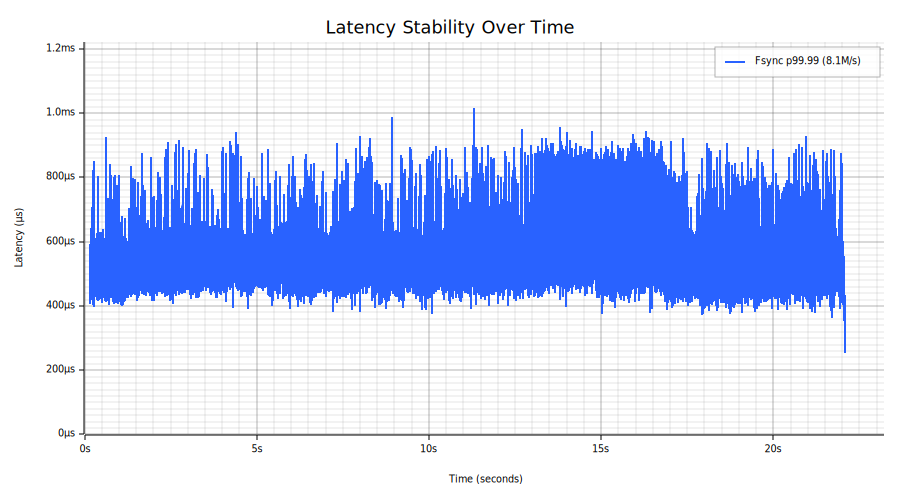
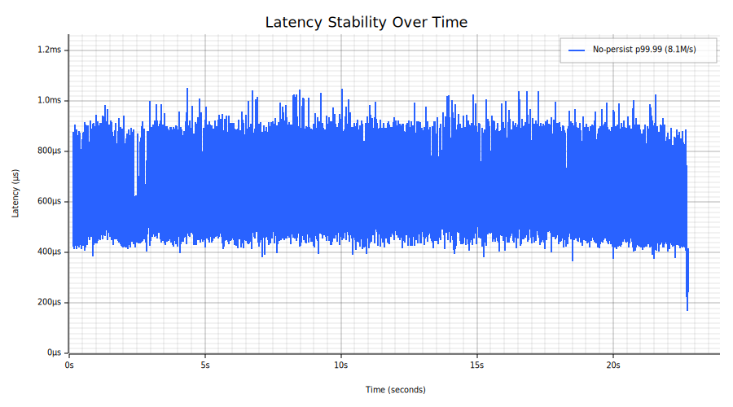

# Melin

Melin is a high-performance exchange matching engine written in Rust on the [LMAX disruptor architecture](https://martinfowler.com/articles/lmax.html), built for venues that cannot compromise on correctness, durability, or latency. It delivers 6.7M orders/sec with synchronous replication and full fsync durability, maintaining sub-millisecond p99.9 latency by pipelining persistence with execution without cutting corners. Its single-threaded core ensures deterministic behavior, with lock-free I/O and event sourcing providing replayability and optional BLAKE3 hash chains providing tamper-evident audit trails. Core exchange features such as risk controls, circuit breakers, fee models, and replication, are already implemented, with the system progressing toward full production readiness.

## Architecture

```
                           ┌────────────────────────────────────────────────────────────┐
                           │                          PRIMARY                           │
                           │                                                            │
  Clients ─TCP────────────────────────► Accept Loop                                     │
                           │                │                                           │
                           │                ▼                                           │
                           │            Epoll/io_uring Reader Pool                      │
                           │            (edge-triggered, non-blocking)                  │
                           │                │                                           │
                           │                │  lock-free CAS                            │
                           │                ▼                                           │
                           │   ┌─────────────────────────────────┐                      │
                           │   │     Input Disruptor (ring buf)  │                      │
                           │   └──────────┬──────────────┬───────┘                      │
                           │              │              │                              │
                           │              ▼              ▼                              │
  ┌──────────────────┐     │   ┌──────────────┐  ┌──────────────┐                       │
  │     REPLICA      │     │   │   Journal    │  │   Matching   │  parallel consumers   │
  │                  │     │   │   Thread     │  │   Thread     │                       │
  │  replay + fsync  │◄────┼───│              │  │              │                       │
  │                  │repl │   │ pwritev2     │  │ Exchange     │                       │
  │  ack ─┐          │ring │   │ + RWF_DSYNC  │  │ .execute()   │                       │
  └───────┼──────────┘     │   └──────┬───────┘  └──────┬───────┘                       │
          │                │          │                 │                               │
          │ repl cursor    │          │ journal cursor  │ output SPSC                   │
          │                │          ▼                 ▼                               │
          │                │   ┌──────────────────────────────┐                         │
          └──────────────► │   │       Response Thread        │                         │
                           │   │                              │                         │
                           │   │  gates on min(journal cursor,│                         │
                           │   │      repl cursor)            │                         │
                           │   └──────────────┬───────────────┘                         │
                           │                  │                                         │
                           └──────────────────┼─────────────────────────────────────────┘
                                              │
  Clients ◄─TCP───────────────────────────────┘
```

- **Single-threaded matching engine** — no locks on the hot path; one thread executes all matching logic
- **LMAX-style disruptor pipeline** ([docs/pipeline-architecture.md](docs/pipeline-architecture.md)) — 3 OS threads (journal, matching, response) on lock-free ring buffers; lock-free CAS-based multi-producer from reader pool; journal and matching run in parallel on the same events
- **Persist-before-ack** — pipelined journal I/O with full durability guarantee; matching latency overlapped against journal writes, acknowledgement gated on confirmed durability, not optimistically sent
- **Synchronous replication** — journal batches streamed to a replica via a lock-free ring buffer; replica fsyncs and acks before the primary sends responses to clients (zero data loss)
- **Batch sync amortization** — under load, one sync covers many events; `pwritev2` with `RWF_DSYNC` (Force Unit Access) combines write + durability in a single syscall; `posix_fallocate` pre-allocates 64 MiB chunks so sync only flushes data pages, not extent metadata
- **Event sourcing** — deterministic replay for crash recovery and audit; snapshots for fast restart; BLAKE3 hash chain for tamper evidence
- **Mechanical sympathy** — cache-line-padded sequences, fixed-point pricing (no floats), pre-allocated buffers with no per-order allocations on the hot path

## Features

Checklist of features expected of a production trade execution engine. Items marked with **[x]** are implemented; **[ ]** are planned.

### Order Types
- [x] Market
- [x] Limit
- [x] Stop (stop-loss)
- [x] Stop-Limit
- [ ] Iceberg (hidden quantity)

### Time-in-Force
- [x] GTC (Good-Til-Cancelled)
- [x] IOC (Immediate-Or-Cancel)
- [x] FOK (Fill-Or-Kill)
- [ ] GTD (Good-Til-Date)
- [ ] Day

### Execution Qualifiers
- [ ] Post-Only (maker-only, reject if would take)

### Matching Engine ([docs/matching-engine.md](docs/matching-engine.md))
- [x] Strict price-time priority (sorted Vec + binary search order book)
- [x] Execution reports: Fill (with fees), Placed, Triggered, Cancelled, Rejected, Replaced
- [x] Multi-instrument exchange with shared account balances
- [x] Cancel-replace / order amendment (atomic price/qty modify; preserves queue priority when price unchanged, loses priority on price change)
- [x] Circuit breakers (price bands, trading halts — per-instrument `CircuitBreakerConfig`)
- [ ] Auction mechanisms (opening/closing/volatility auctions)

### Fees ([docs/fee-model.md](docs/fee-model.md))
- [x] Maker/taker fee model (per-instrument `FeeSchedule` in basis points, configurable via admin API)
- [x] Fee deduction on fill (fees in quote currency, deducted from buyer reservation and seller proceeds, reported in `ExecutionReport::Fill`)
- [ ] Tiered fee schedules (volume-based tiers, account-level overrides)

### Risk & Accounting ([docs/risk-checks.md](docs/risk-checks.md), [docs/balance-management.md](docs/balance-management.md))
- [x] Per-account, per-currency balance management (reserve on order, update on fill, release on cancel)
- [x] Self-trade prevention (per-order modes: CancelNewest, CancelOldest, CancelBoth)
- [x] Fat finger checks (max order size, max notional value — per-instrument configurable `RiskLimits`)
- [x] Kill switch (cancel all resting orders and pending stops for an account across all instruments)
- [x] Client deduplication (per-account OrderId high-water mark — prevents double-execution on crash-recovery retry)
- [x] Price band checks (static lower/upper bounds, per-instrument — part of circuit breaker config)
- [ ] Position/exposure limits
- [ ] Order throttling (per-account rate limiting)
- [x] Bulk account provisioning (`ProvisionAccount` journal event — O(accounts) seeding, ~0.5s for 1M accounts)
- [x] Sparse account storage (memory scales with active accounts). Uses `astenn` extendible hashing (grows one bucket at a time, no full-table rehash spikes). See [docs/account-lifecycle.md](docs/account-lifecycle.md).
- [x] Withdraw event (debit funds, auto-evict zero-balance entries)
- [ ] Custodian permission role (Deposit/Withdraw only — no trading, no admin ops)
- [x] Extendible hashing for account lookup tables (`astenn` — custom extendible hash table, grows one bucket at a time with bounded per-operation cost)

### Event Sourcing & Durability ([docs/journal.md](docs/journal.md))
- [x] Write-ahead journal with CRC32C checksums
- [x] Batch journal I/O via LMAX disruptor ring buffer pipeline
- [x] Pre-allocated storage (`posix_fallocate`) for reduced fsync latency
- [x] Snapshot save/load for fast recovery
- [x] Deterministic replay from journal
- [x] Pipelined io_uring async fsync with group commit
- [x] Journal rotation (automatic snapshot + archive when size threshold exceeded at startup)
- [x] BLAKE3 hash chain with periodic checkpoints (tamper evidence, replica consistency verification)
- [ ] Output event log (durable ExecutionReport stream for audit trail)

### Networking ([docs/wire-protocol.md](docs/wire-protocol.md))
- [x] Custom binary wire protocol (length-prefixed framing)
- [x] TCP transport with `TCP_NODELAY`
- [x] Unix domain socket transport
- [x] Epoll reader pool (edge-triggered, non-blocking) with dedicated I/O threads (zero tokio)
- [x] Lock-free CAS-based multi-producer disruptor (no mutex on input path)
- [x] io_uring transport (separate read/write rings, multishot RECV with provided buffer groups)
- [x] Typed client library
- [x] Terminal UI for interactive testing
- [x] Heartbeats and connection timeouts (bidirectional keepalive, configurable idle timeout detection)
- [ ] Batched io_uring SEND in response stage (reduce per-response syscall overhead)
- [ ] TCP_CORK / MSG_MORE response batching (coalesce small frames into single TCP segments)
- [ ] Backpressure handling (defined policy when disruptor is full)
- [ ] TLS (encrypted client connections)

### Gateway
- [x] TCP proxy between clients and engine (binary protocol)
- [ ] Scalable I/O model (epoll/io_uring multiplexing — current 2-threads-per-client caps at ~500 connections)
- [ ] Output event channel from matching stage (broadcast — prerequisite for market data)
- [ ] Market data dissemination (L2 snapshots, trade feed, BBO push updates)
- [ ] Subscription management (subscribe/unsubscribe per instrument)
- [ ] Reference data management (instrument lifecycle)
- [ ] Rate limiting and connection management (per-client throttling)

### Authentication & Authorization ([docs/admin-guide.md](docs/admin-guide.md))
- [x] Client authentication (Ed25519 challenge-response handshake)
- [ ] Per-account trading permissions
- [x] Admin API (instrument management, deposits, circuit breaker controls, kill switch, risk limits, fee schedules, cancel-replace, live stats dashboard)

### Operations & Reliability ([docs/operations.md](docs/operations.md))
- [x] Structured logging (`tracing` crate, error-level for server malfunctions only)
- [x] Per-stage pipeline latency tracing (`latency-trace` feature gate)
- [x] Configuration management (CLI args for bind address, journal path, core affinity, reader threads)
- [x] Graceful shutdown (SIGINT/SIGTERM handler, ordered drain: readers → journal → matching → response)
- [x] Health checks / readiness probes (`ServerReady` wire handshake on connect)

### Metrics & Observability

Most analytics can run on a **replica** replaying the journal, keeping the primary's hot path free of instrumentation jitter.

#### Primary node (lightweight, operational health)
- [x] Pipeline stage utilization (`pipeline-stats` feature gate — busy/idle ratio per stage)
- [x] Admin TUI observability dashboard (live connection count, events processed, throughput, journal sequence — polled via `QueryStats` through the pipeline)
- [ ] Metrics transport (Prometheus endpoint or stats file — must not touch the hot path)
- [ ] Disruptor queue depth / backpressure monitoring (input ring fill level)
- [ ] Health/liveness endpoint (beyond current `ServerReady` handshake)

#### Replica or offline (journal-derived, zero primary impact)
- [ ] Order/fill/cancel throughput counters (events per second by type)
- [ ] Latency histograms (journal `timestamp_ns` → matching → response, per-event)
- [ ] Volume analytics (traded volume per instrument, per account)
- [ ] Book depth analytics (resting order counts, spread tracking)
- [ ] Audit trail queries (full event history for regulatory compliance)
- [ ] Fee/PnL accounting (when fees and position tracking exist)

### Testing
- [x] `proptest` invariant tests (price-time priority, volume conservation, balance conservation, book/reservation/order-sides consistency, overflow safety, STP enforcement — all order types including stops, all STP modes, circuit breaker toggling, cancel-all)
- [x] Verified `price × quantity` intermediate calculations don't overflow `u64` (use `u128` for computed values)
- [x] Bolero fuzz tests for journal and wire protocol codecs (decode crash discovery + encode/decode round-trip)
- [x] Security audit ([docs/security-audit.md](docs/security-audit.md))

### Redundancy & High Availability
- [x] Synchronous journal replication ([docs/replication.md](docs/replication.md)) — live WAL streaming to replica via lock-free ring buffer, ack-gated responses, replica receiver with deterministic replay
- [ ] Halt trading on replica disconnect (currently degrades silently to local-only, acking un-replicated orders)
- [ ] Catch-up from journal files (late-joining replica reads historical entries before live stream)
- [ ] Snapshot transfer (replica too far behind for journal catch-up)
- [ ] Manual promotion (operator command to promote replica to primary)
- [ ] Failover detection and promotion (leader election, split-brain prevention)
- [ ] Client failover (reconnect to new primary, resume with sequence numbers)
- [ ] Network partition handling (fencing, quorum-based decisions)

## Priority Roadmap

Ordered by importance for commercial readiness (exchange operators and investors).

1. ~~**Circuit breakers**~~ ✅ — price bands, trading halts. Fully integrated with event sourcing.
2. ~~**Cancel-replace / order amendment**~~ ✅ — atomic price/qty amendment with reservation delta, time priority rules, price-would-cross rejection.
3. ~~**Replication & HA**~~ ✅ (phase 1) — synchronous journal streaming via lock-free ring buffer, ack-gated responses (zero data loss), replica receiver with deterministic replay. Next: journal catch-up, snapshot transfer, manual promotion, automatic failover.
4. ~~**Fuzz testing**~~ ✅ — proptest coverage extended to all order types, STP modes, circuit breakers, stops. Found and fixed a reservation leak on price-improved fills.
5. ~~**Journal rotation + integrity**~~ ✅ — automatic snapshot + journal archiving at startup when size threshold exceeded. BLAKE3 hash chain with periodic checkpoints for tamper evidence and replica consistency. Documented recovery scenarios for every crash timing.
6. ~~**Authentication**~~ ✅ — Ed25519 challenge-response. Admin API for instrument/deposit/risk/circuit-breaker management.
7. ~~**TLS**~~ (deferred) — not needed for VLAN deployments. Ed25519 challenge-response provides identity without encryption overhead on the hot path.
8. **Metrics & observability** — connection counts, queue depth, health endpoints. Operators need visibility.
9. **Auction mechanisms** — opening/closing/volatility auctions. Differentiator for regulated venues.
10. ~~**Fee model**~~ ✅ — per-instrument maker/taker fees in basis points. Deducted from fill proceeds in quote currency. Configurable via admin API, journaled for deterministic replay.
11. ~~**Documentation**~~ ✅ — matching engine, fee model, risk checks, balance management, pipeline architecture, wire protocol, admin guide, operations runbook, benchmarking guide.
12. **Security hardening** — remaining [audit findings](docs/security-audit.md): per-account order limits (SEC-03), order throttling (SEC-04), disk exhaustion handling (SEC-05), snapshot validation (SEC-09).

Also needed: backpressure policy, gateway scalability (epoll/io_uring multiplexing), per-account permissions, crash injection tests (kill server at random points during load, verify recovery produces identical state — validates journal/snapshot/rotation crash safety end-to-end).

### Benchmarking & Measurements ([docs/benchmarking.md](docs/benchmarking.md))
- [x] Realistic order flow generator (power-law prices/sizes, cancels, fills, multiple accounts, STP diversity)
- [x] Multi-threaded io_uring benchmark client (`--bench-threads`)
- [x] JSON output for machine-readable results (`--json`)
- [x] TUI charts: tail latency stability and latency histogram (`--features chart`)
- [x] Dynamic percentile depth based on sample size
- [ ] Saturation curve — sweep `--clients` and `--window`, plot latency vs throughput from JSON output
- [ ] Multi-machine benchmark — run bench from multiple machines simultaneously (`--account-id`, `--order-id-offset`)
- [ ] Real-world data replay (NASDAQ ITCH 5.0, Databento, Lobster — legal review needed)

### Performance Tuning

See [docs/performance.md](docs/performance.md) for the full performance profile, improvement roadmap, and completed optimizations.

## Project Structure

```
crates/
├── disruptor/     Lock-free ring buffers (generic, no trading-domain knowledge)
├── engine/        Matching engine, order books, event sourcing, journal pipeline
├── protocol/      Binary wire protocol, transport abstractions, blocking I/O
├── server/        Server, pipeline orchestration, dedicated I/O threads
├── admin/         CLI admin tool (instruments, deposits, fees, risk, circuit breakers, live dashboard)
├── bench/         Benchmark suite (engine, pipeline, and full round-trip modes)
├── client/        Typed client library
└── tui/           Terminal UI for interactive testing
```

## Performance

LAN round-trip benchmarks at [`ed9241d`](../../commit/ed9241d). Two or three Cherry AMD Ryzen 9 9950X servers (16C @ 4.3 GHz, SMT disabled, 96 GB 5600 MHz RAM, 2x 1TB NVMe, 10 Gbps). Engine on one server with journal on a dedicated NVMe disk, benchmark client on the second, replica on the third (replication only). TCP over private VLAN, IRQs pinned to core 0. [Realistic order flow](crates/bench/). Reproducible via `scripts/lan-bench-suite.sh`.

### Headline numbers

| Mode | Throughput | p50 | p99 | p99.9 | max |
|------|-----------|-----|-----|-------|-----|
| **Full durability** (fsync) | **8.1M orders/sec** | 439 µs | 569 µs | 636 µs | 1,017 µs |
| **Synchronous replication** | **5.8M orders/sec** | 633 µs | 841 µs | 933 µs | 1,123 µs |
| **Single-order latency** | 13.7K orders/sec | **72 µs** | 87 µs | 90 µs | 207 µs |
| **No persistence** | **8.1M orders/sec** | 453 µs | 602 µs | 668 µs | 1,054 µs |

### Peak-load throughput — full durability

100M order pairs, 16 clients, 256 pipelined, `pwritev2` + `RWF_DSYNC` (FUA) journaling:

| Metric | Value |
|--------|-------|
| **Throughput** | 8.1M orders/sec |
| **p50** | 439 µs |
| **p90** | 511 µs |
| **p99** | 569 µs |
| **p99.9** | 636 µs |
| **p99.99** | 841 µs |
| **p99.999** | 901 µs |
| **max** | 1,017 µs |

### Synchronous replication — full durability

100M order pairs, 16 clients, 256 pipelined. Primary + replica, both with dedicated NVMe journals, ack-gated responses (zero data loss):

| Metric | Value |
|--------|-------|
| **Throughput** | 5.8M orders/sec |
| **p50** | 633 µs |
| **p90** | 745 µs |
| **p99** | 841 µs |
| **p99.9** | 933 µs |
| **p99.99** | 991 µs |
| **p99.999** | 1,065 µs |
| **max** | 1,123 µs |

### Single-order latency — full durability

500K order pairs, 1 client, no pipelining (window=1):

| Metric | Value |
|--------|-------|
| **Throughput** | 13.7K orders/sec |
| **p50** | 72 µs |
| **p90** | 73 µs |
| **p99** | 87 µs |
| **p99.9** | 90 µs |
| **p99.99** | 99 µs |
| **p99.999** | 188 µs |
| **max** | 207 µs |

### Peak-load throughput — no persistence

100M order pairs, 16 clients, 256 pipelined:

| Metric | Value |
|--------|-------|
| **Throughput** | 8.1M orders/sec |
| **p50** | 453 µs |
| **p90** | 536 µs |
| **p99** | 602 µs |
| **p99.9** | 668 µs |
| **p99.99** | 871 µs |
| **p99.999** | 921 µs |
| **max** | 1,054 µs |

### Plots

**Latency CDF** — three peak-load modes on the same axes:


**Latency stability over time** (p99.99):






## License

Copyright (c) 2026 Pierre Larger. All Rights Reserved.
