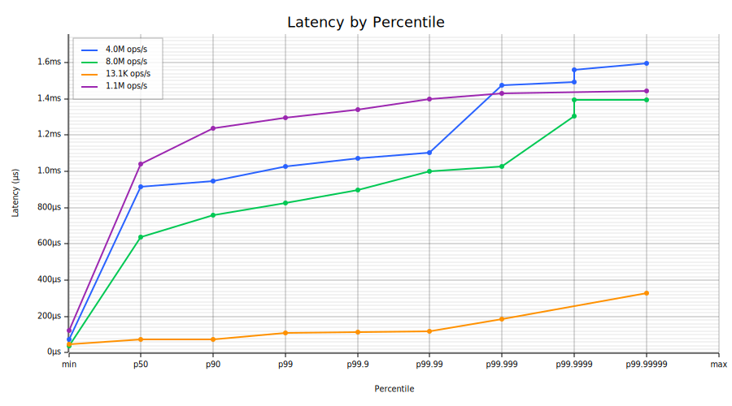
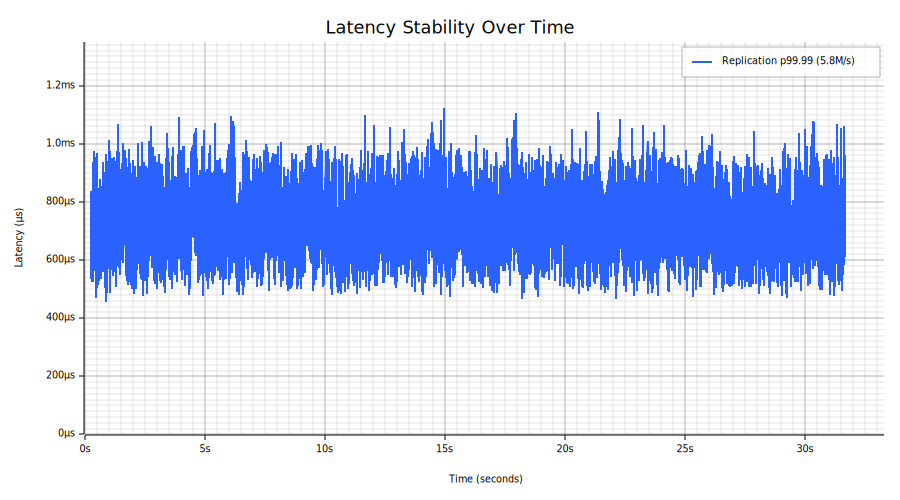

# Melin

Melin is a high-performance exchange core written in Rust on the [LMAX disruptor architecture](https://martinfowler.com/articles/lmax.html), built for venues that cannot compromise on correctness, durability, or latency. It delivers over 5M orders/sec over LAN with synchronous replication and full fsync durability, with sub-100 µs p99.9 single-order latency, pipelining persistence with execution without cutting corners. Beyond order matching, Melin handles account management, risk controls, circuit breakers, fee schedules, authentication, journaling, and replication — everything an exchange needs between the network edge and the trading API. Its single-threaded matching core ensures deterministic behavior, with lock-free I/O and event sourcing providing replayability and tamper-evident audit trails.

## Scope

Melin is an exchange core: order matching, account management, risk controls, fee calculation, journaling, replication, and connection authentication. It handles everything between the network edge and the trading API. Gateway concerns — market data fan-out, client session management, per-account rate limiting, account identity and authorization, FIX/ITCH protocol translation — are out of scope and handled by upstream services that consume Melin's output event channel.

## Correct

- **Strict price-time priority** — no order may jump the queue; matching correctness is verified by property-based tests across thousands of random order sequences
- **Deterministic replay** — given the same journal, replay produces identical state bit-for-bit; the foundation of crash recovery, replication, and auditability
- **Balance conservation** — funds are never created or destroyed; every reserve, fill, release, and withdrawal is tracked and verified by proptest invariants
- **Client deduplication** — per-account order ID high-water mark prevents double execution on crash-recovery retry
- **Extensive testing** — property-based tests (proptest) verify invariants across thousands of random order sequences: price-time priority on both sides, balance conservation across fills/cancels/fees/STP, volume conservation, reservation consistency, no self-trades under STP, deterministic replay, and overflow safety. Fuzz testing (bolero) covers journal and wire protocol decoding. Integration tests cover snapshot round-trip, journal replay, and crash recovery

## Durable

- **Persist-before-ack** — pipelined journal I/O with full durability guarantee; matching latency overlapped against journal writes, acknowledgement gated on confirmed durability, not optimistically sent
- **Synchronous replication** — journal batches streamed to a replica via a lock-free ring buffer; replica fsyncs and acks before the primary sends responses to clients (zero data loss)
- **Event sourcing** — deterministic replay for crash recovery and audit; snapshots for fast restart; BLAKE3 hash chain for tamper evidence
- **Journal rotation** — automatic snapshot and archive when journal size exceeds threshold; recovery from latest snapshot plus incremental journal
- **Crash safety** — truncated writes detected via CRC32C checksums; partial entries discarded on recovery; tested with crash injection at every pipeline stage

## Efficient

### Architecture

```
                           ┌────────────────────────────────────────────────────────────┐
                           │                          PRIMARY                           │
                           │                                                            │
  Clients ─TCP────────────────────────► Accept Loop                                     │
                           │                │                                           │
                           │                ▼                                           │
                           │            Epoll/io_uring Reader Pool                      │
                           │            (edge-triggered, non-blocking)                  │
                           │                │                                           │
                           │                │  lock-free CAS                            │
                           │                ▼                                           │
                           │   ┌─────────────────────────────────┐                      │
                           │   │     Input Disruptor (ring buf)  │                      │
                           │   └──────────┬──────────────┬───────┘                      │
                           │              │              │                              │
                           │              ▼              ▼                              │
  ┌──────────────────┐     │   ┌──────────────┐  ┌──────────────┐                       │
  │     REPLICA      │     │   │   Journal    │  │   Matching   │  parallel consumers   │
  │                  │     │   │   Thread     │  │   Thread     │                       │
  │  replay + fsync  │◄────┼───│              │  │              │                       │
  │                  │repl │   │ pwritev2     │  │ Exchange     │                       │
  │  ack ─┐          │ring │   │ + RWF_DSYNC  │  │ .execute()   │                       │
  └───────┼──────────┘     │   └──────┬───────┘  └──────┬───────┘                       │
          │                │          │                 │                               │
          │ repl cursor    │          │ journal cursor  │ Output Disruptor Ring         │
          │                │          ▼                 ▼                               │
          │                │   ┌──────────────────────────────┐                         │
          └──────────────► │   │       Response Thread        │ consumer 0              │
                           │   │  gates on min(journal cursor,│                         │
                           │   │      repl cursor)            │                         │
                           │   └──────────────┬───────────────┘                         │
                           │                  │                                         │
                           │   ┌──────────────┴───────────────┐                         │
                           │   │    Event Publisher Thread     │ consumer 1 (optional)   │
                           │   │    (--event-bind, auth'd TCP) │                         │
                           │   └──────────────┬───────────────┘                         │
                           │                  │                                         │
                           └──────────────────┼─────────────────────────────────────────┘
                                              │
  Clients ◄─TCP──────────────────────────────┤
  Subscribers ◄─TCP──────────────────────────┘
```

- **Single-threaded matching engine** — no locks on the hot path; one thread executes all matching logic
- **LMAX-style disruptor pipeline** ([docs/pipeline-architecture.md](docs/pipeline-architecture.md)) — 3 OS threads (journal, matching, response) on lock-free ring buffers; lock-free CAS-based multi-producer from reader pool; journal and matching run in parallel on the same events
- **Batch sync amortization** — under load, one sync covers many events; `pwritev2` with `RWF_DSYNC` (Force Unit Access) combines write + durability in a single syscall; `posix_fallocate` pre-allocates 256 MiB chunks so sync only flushes data pages, not extent metadata
- **Mechanical sympathy** — cache-line-padded sequences, fixed-point pricing (no floats), pre-allocated buffers with no per-order allocations on the hot path

- **Dedicated I/O threads** — epoll/io_uring reader pool with edge-triggered non-blocking I/O; response stage writes directly to sockets; zero async runtime (no tokio)
- **io_uring transport** — multishot RECV with provided buffer groups eliminates SQE resubmission; separate read/write rings
- **Pre-allocated everything** — reservation slab (2M slots), order book indices, and balance maps are pre-sized and page-faulted at startup; no allocations on the hot path
- **jemalloc** — avoids glibc malloc fragmentation and lock contention under sustained load

### Benchmarks

LAN round-trip benchmarks at [`ed9241d`](../../commit/ed9241d). Two or three Cherry AMD Ryzen 9 9950X servers (16C @ 4.3 GHz, SMT disabled, 96 GB 5600 MHz RAM, 2x 1TB NVMe, 10 Gbps). Engine on one server with journal on a dedicated NVMe disk, benchmark client on the second, replica on the third (replication only). TCP over private VLAN, IRQs pinned to core 0. [Realistic order flow](crates/bench/). Reproducible via `scripts/lan-bench-suite.sh`. For production deployment and OS tuning, see [docs/operations.md](docs/operations.md) and [docs/benchmarking.md](docs/benchmarking.md).

| Mode | Throughput | p50 | p99 | p99.9 | max | Parameters |
|------|-----------|-----|-----|-------|-----|------------|
| **Single-order latency** | 13.7K/s | **72 µs** | 87 µs | 90 µs | 207 µs | 500K pairs, 1 client, window 1 |
| **Full durability** (fsync) | **8.1M/s** | 439 µs | 569 µs | 636 µs | 1,017 µs | 100M pairs, 16 clients, window 256 |
| **Synchronous replication** | **5.8M/s** | 633 µs | 841 µs | 933 µs | 1,123 µs | 100M pairs, 16 clients, window 256, primary+replica |

**Latency CDF** — three peak-load modes on the same axes:



**Latency stability over time** (p99.99, replication mode):



### Bottleneck and next steps

The TCP network stack is now the primary throughput limiter. The journal pipeline hides fsync latency at high pipelining depths. Further gains require reducing transport overhead: kernel bypass (AF_XDP, DPDK, or OpenOnload) would eliminate syscall overhead on the send/recv path. See [docs/performance.md](docs/performance.md) for the full analysis and optimization roadmap.

## Features

### Order Types
- Market, Limit, Stop (stop-loss), Stop-Limit
- Time-in-force: GTC, IOC, FOK, Day, GTD (Good-Til-Date)
- Post-Only (maker-only, reject if would take)

### Matching Engine ([docs/matching-engine.md](docs/matching-engine.md))
- Strict price-time priority (sorted Vec + binary search order book)
- Execution reports: Fill (with fees), Placed, Triggered, Cancelled, Rejected, Replaced
- Multi-instrument exchange with shared account balances
- Cancel-replace / order amendment (atomic price/qty modify; preserves queue priority when price unchanged, loses priority on price change)
- Circuit breakers (price bands, trading halts — per-instrument `CircuitBreakerConfig`)

### Fees ([docs/fee-model.md](docs/fee-model.md))
- Maker/taker fee model (per-instrument `FeeSchedule` in basis points, configurable via admin API)
- Fee deduction on fill (fees in quote currency, deducted from buyer reservation and seller proceeds, reported in `ExecutionReport::Fill`)

### Risk & Accounting ([docs/risk-checks.md](docs/risk-checks.md))
- Per-account, per-currency balance management (reserve on order, update on fill, release on cancel)
- Self-trade prevention (per-order modes: CancelNewest, CancelOldest, CancelBoth)
- Fat finger checks (max order size, max notional value — per-instrument configurable `RiskLimits`)
- Kill switch (cancel all resting orders and pending stops for an account across all instruments)
- Client deduplication (per-account OrderId high-water mark — prevents double-execution on crash-recovery retry)
- Price band checks (static lower/upper bounds, per-instrument — part of circuit breaker config)
- Withdraw event (debit funds, auto-evict zero-balance entries)

### Event Sourcing & Durability ([docs/journal.md](docs/journal.md))
- Write-ahead journal with CRC32C checksums
- Batch journal I/O via LMAX disruptor ring buffer pipeline
- Pre-allocated storage (`posix_fallocate`) for reduced fsync latency
- Snapshot save/load for fast recovery
- Deterministic replay from journal
- Pipelined io_uring async fsync with group commit
- Journal rotation (automatic snapshot + archive when size threshold exceeded at startup)
- BLAKE3 hash chain with periodic checkpoints (tamper evidence, replica consistency verification)

### Networking ([docs/wire-protocol.md](docs/wire-protocol.md))
- Custom binary wire protocol (length-prefixed framing)
- TCP and Unix domain socket transports (kernel bypass via AF_XDP and DPDK in progress)
- Epoll reader pool (edge-triggered, non-blocking) with dedicated I/O threads (zero tokio)
- io_uring transport (separate read/write rings, multishot RECV with provided buffer groups)
- Backpressure handling (explicit `ServerBusy` reject when the input pipeline is full — no silent drops or reader thread stalls; client should back off and retry). See [docs/wire-protocol.md](docs/wire-protocol.md)

### Authentication & Authorization ([docs/admin-guide.md](docs/admin-guide.md))
- Client authentication (Ed25519 challenge-response handshake)
- Four permission roles with separation of duties: Operator (exchange configuration), Trader (order submission/cancellation), Custodian (deposit/withdraw), ReadOnly (heartbeats)
- Operator API (instrument management, circuit breaker controls, kill switch, risk limits, fee schedules, end-of-day, live stats dashboard)
- Idempotency for admin operations (per-key sequence numbers with duplicate rejection — safe to retry on timeout without double-applying)

### Operations & Reliability ([docs/operations.md](docs/operations.md))
- Structured logging (`tracing` crate, error-level for server malfunctions only)
- Health/liveness TCP endpoint (`--health-bind`, returns `OK <conns> <seq> <lag>`) with Prometheus `/metrics` endpoint
- Sparse account storage to reduce memory usage, see [docs/account-lifecycle.md](docs/account-lifecycle.md).

### Output Event Channel
- Real-time broadcast of all execution events (fills, placements, cancellations) to TCP subscribers via `--event-bind`
- Second consumer on the output disruptor ring — zero overhead when disabled (single consumer, identical to before)
- Ed25519 challenge-response authentication (ReadOnly permission or above)
- Per-frame monotonic sequence numbers for gap detection
- Slow subscriber policy: non-blocking writes, disconnect on `WouldBlock`
- Foundation for market data gateways, analytics services, and audit loggers

### Metrics & Observability
- Prometheus metrics endpoint (`GET /metrics` on the health port — active connections, events processed, journal sequence, replication lag, pipeline health, input queue depth, trading state)
- Admin TUI observability dashboard (live connection count, events processed, throughput, journal sequence — polled via `QueryStats` through the pipeline)

### Redundancy & High Availability
- Synchronous journal replication ([docs/replication.md](docs/replication.md)) — live WAL streaming to replica via lock-free ring buffer, ack-gated responses, replica receiver with deterministic replay
- Automatic trading halt on replica disconnect — new orders rejected with `ReplicaDisconnected`, orders already in the pipeline complete normally. Resumes instantly on reconnect (atomic flag flip). See [docs/operations.md](docs/operations.md)
- Manual promotion — operator sends `PROMOTE` to the replica's trigger endpoint (`melin-promote <addr>`). In-process transition reuses the warm Exchange state with zero re-replay, sub-second switchover. See [docs/operations.md](docs/operations.md)


## Project Structure

```
crates/
├── disruptor/     Lock-free ring buffers (generic, no trading-domain knowledge)
├── engine/        Matching engine, order books, event sourcing, journal pipeline
├── protocol/      Binary wire protocol, codec, transport abstractions
├── server/        Server, pipeline orchestration, dedicated I/O threads
├── admin/         CLI admin tool (instruments, deposits, fees, risk, circuit breakers, live dashboard)
├── bench/         Benchmark suite (engine, pipeline, and full round-trip modes)
├── client/        Typed client library
└── tui/           Terminal UI for interactive testing
```

## License

Copyright (c) 2026 Pierre Larger. All Rights Reserved.

Commercial licensing available — contact [pierre.larger@gmail.com](mailto:pierre.larger@gmail.com).
